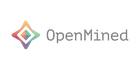

# PPML: Machine Learning on Data you cannot see

Repository for the [tutorial](https://schedule.mozillafestival.org/session/3TAPD8-1) on **Privacy-Preserving Machine Learning** (`PPML`) presented at [SciPy 2023](https://www.scipy2023.scipy.org/)

## Intro

Privacy guarantee is **the** most crucial requirement when it comes to analyse sensitive data.
However, data anonymisation techniques alone do not always provide complete privacy protection;
moreover Machine Learning models could also be exploited to _leak_ sensitive data when _attacked_,
and no counter-measure is applied.
*Privacy-preserving machine learning* (PPML) methods hold the promise to overcome all these issues,
allowing to train machine learning models with full privacy guarantees. In this tutorial we will explore
several methods for privacy-preserving data analysis, and how these techniques can be used to safely train
ML models _without_ actually seeing the data.

### Description

Privacy guarantees are **the** most crucial requirement when it comes to analyse sensitive data. These requirements could be sometimes very stringent, so that it becomes a real barrier for the entire pipeline. Reasons for this are manifold, and involve the fact that data could not be _shared_ nor moved from their silos of resident, let alone analysed in their _raw_ form. As a result, _data anonymisation techniques_ are sometimes used to generate a sanitised version of the original data. However, these techniques alone are not enough to guarantee that privacy will be completely preserved. Moreover, the _memoisation_ effect of Deep learning  models could be maliciously exploited to _attack_ the models, and _reconstruct_  sensitive information about samples used in training, even if these information were not originally provided. 

*Privacy-preserving machine learning* (PPML) methods hold the promise to overcome all those issues, allowing to train machine learning models with full privacy guarantees.

This workshop will be mainly organised in **three** main parts. In the first part, we will introduce the main concepts of **differential privacy**: what is it, and how this method differs from more classical _anonymisation_ techniques (e.g. `k-anonymity`).  In the second part, we will focus on Machine learning experiments. We will start by demonstrating how DL models could be exploited (i.e. _inference attack_ ) to reconstruct original data solely analysing models predictions; and then we will explore how **differential privacy** can help us protecting the privacy of our model, with _minimum disruption_ to the original pipeline. Finally, we will conclude the tutorial considering more complex ML scenarios to train Deep learning networks on encrypted data, with specialised _distributed federated_ _learning_ strategies.

### Outline

- **Introduction**: Brief Intro to `PPML` and to the workshop (`10 mins`) [SLIDES](https://speakerdeck.com/leriomaggio/ppml-scipy)

- **Part 1**: Programming Privacy (`90 mins`)
  - De-identification
  - K-anonimity and limitations
  - Differential Privacy
  - Intro to Differential Privacy for Machine Learning

- Break (`10 mins`)

- **Part 2**: Strengthening Deep Neural Networks (`60 mins`)
  - ML Model vulnerabilities: Adversarial Examples and _inference attack_
  - DL training with Differential Privacy

- **Break** (`5 mins`)

- **Part 3**: Primer on Privacy-Preserving Machine Learning (`60 mins`)
  - DL training on (Homomorphically) Encrypted Data
  - Federated Learning

- **Closing Remarks** (`5 mins`)

#### Notebooks

Quick access to each notebooks, also to open on **Anaconda Notebooks**

1 Data Anonimisation
  - References: [](https://anaconda.cloud/api/nbserve/launch_notebook?nb_url=https%3A%2F%2Fraw.githubusercontent.com%2Fleriomaggio%2Fppml-tutorial%2Fmain%2F1-data-anonimisation%2F1-references.ipynb)
  
  - De-identification: [](https://anaconda.cloud/api/nbserve/launch_notebook?nb_url=https%3A%2F%2Fraw.githubusercontent.com%2Fleriomaggio%2Fppml-tutorial%2Fmain%2F1-data-anonimisation%2F2-de-identification.ipynb)

  - K-Anonimity: [](https://anaconda.cloud/api/nbserve/launch_notebook?nb_url=https%3A%2F%2Fraw.githubusercontent.com%2Fleriomaggio%2Fppml-tutorial%2Fmain%2F1-data-anonimisation%2F3-k-anonimity.ipynb)

2 Differential Privacy

  - Differential Privacy [](https://anaconda.cloud/api/nbserve/launch_notebook?nb_url=https%3A%2F%2Fraw.githubusercontent.com%2Fleriomaggio%2Fppml-tutorial%2Fmain%2F2-differential-privacy%2F1-differential-privacy.ipynb)


  - Properties of Differential Privacy [](https://anaconda.cloud/api/nbserve/launch_notebook?nb_url=https%3A%2F%2Fraw.githubusercontent.com%2Fleriomaggio%2Fppml-tutorial%2Fmain%2F2-differential-privacy%2F2-properties-differential-privacy.ipynb)


  - Approx Differential Privacy [](https://anaconda.cloud/api/nbserve/launch_notebook?nb_url=https%3A%2F%2Fraw.githubusercontent.com%2Fleriomaggio%2Fppml-tutorial%2Fmain%2F2-differential-privacy%2F3-approx-differential-privacy.ipynb)


  - Differential Privacy ML Models [](https://anaconda.cloud/api/nbserve/launch_notebook?nb_url=https%3A%2F%2Fraw.githubusercontent.com%2Fleriomaggio%2Fppml-tutorial%2Fmain%2F2-differential-privacy%2F4-differential-privacy-ml.ipynb)


3 ML Models Attacks

- FSGM Attack [](https://anaconda.cloud/api/nbserve/launch_notebook?nb_url=https%3A%2F%2Fraw.githubusercontent.com%2Fleriomaggio%2Fppml-tutorial%2Fmain%2F3-ml-models-attacks%2F0-FSGM-Attack.ipynb)

- MIA Training [](https://anaconda.cloud/api/nbserve/launch_notebook?nb_url=https%3A%2F%2Fraw.githubusercontent.com%2Fleriomaggio%2Fppml-tutorial%2Fmain%2F3-ml-models-attacks%2F1-MIA-Training.ipynb)

- MIA Reconstruction [](https://anaconda.cloud/api/nbserve/launch_notebook?nb_url=https%3A%2F%2Fraw.githubusercontent.com%2Fleriomaggio%2Fppml-tutorial%2Fmain%2F3-ml-models-attacks%2F2-MIA-Reconstruction.ipynb)


- MIA Training with DP [](https://anaconda.cloud/api/nbserve/launch_notebook?nb_url=https%3A%2F%2Fraw.githubusercontent.com%2Fleriomaggio%2Fppml-tutorial%2Fmain%2F3-ml-models-attacks%2F4-MIA-Training-OPACUS.ipynb)


- MIA Reconstruction with DP [](https://anaconda.cloud/api/nbserve/launch_notebook?nb_url=https%3A%2F%2Fraw.githubusercontent.com%2Fleriomaggio%2Fppml-tutorial%2Fmain%2F3-ml-models-attacks%2F5-MIA-Reconstruction-OPACUS.ipynb)


4 Federated Learning

- Intro to Federated Learning [](https://anaconda.cloud/api/nbserve/launch_notebook?nb_url=https%3A%2F%2Fraw.githubusercontent.com%2Fleriomaggio%2Fppml-tutorial%2Fmain%2F4-federated-learning%2F1-Intro-Federated-Learning.ipynb)


- Homomorphic Encryption [](https://anaconda.cloud/api/nbserve/launch_notebook?nb_url=https%3A%2F%2Fraw.githubusercontent.com%2Fleriomaggio%2Fppml-tutorial%2Fmain%2F4-federated-learning%2F2-Homomorphic-Encryption.ipynb)


- Flower FL [](https://anaconda.cloud/api/nbserve/launch_notebook?nb_url=https%3A%2F%2Fraw.githubusercontent.com%2Fleriomaggio%2Fppml-tutorial%2Fmain%2F4-federated-learning%2F4-flower-tutorial-pytorch.ipynb)

## Get the material

Clone the current repository by running the following instructions:

```bash
cd $HOME  # This will make sure you'll be in your HOME folder
git clone https://github.com/leriomaggio/ppml-tutorial.git
```

**Note**: This will create a new folder named `ppml-tutorial`. Move into this folder by typing:

```bash
cd ppml-tutorial
```

Well done! Now you should do be in the right location.
Bear with me for another few seconds, following instructions reported below 🙏

## Installation Instructions (or not 🙃)

All the materials in this tutorial (code, and lecture notes) are made available as
Jupyter notebooks.

**(1)** There is no specific _hardware requirement_ to execute the code, i.e. running everything
on your laptop should be more than fine 😊.

**(2)**: As for the _software requirements_, we will be using a pretty standard Python/PyData stack:
`numpy`, `pandas`, `matplotlib`, and `scikit-learn` for all the data science and Machine learning parts,
along with `pytorch` and `torchvision` to work on the Deep Learning examples.

Moreover, a few **extra** / specialised packages will be also featured:
- [Opacus](https://opacus.ai): A library to train PyTorch models with differential privacy
- [PHE](https://pypi.org/project/phe/): A Python 3 library implementing the Paillier Partially Homomorphic Encryption
- [Flower](https://flower.dev): A Federated Learning library for PyTorch


To get ready to run the code in this tutorial you could either (a) install and configure a (`conda`) environment
on your computer with all the necessary dependency; or (b) use [**Anaconda Notebooks**](https://nb.anaconda.cloud)
and run everything without installing anything at all on your computer.

Please refer to the [`setup.md`](./setup.md) document for step-by-step instructions, or to get a special
**discount code** to access Anaconda Notebooks.

If you spot any error/mistake, please feel free to reach out directly to [me](mailto:vmaggio@anaconda.com?subject=PPML%20SciPy23%20Issue), or to open an [Issue](http://github.com/leriomaggio/ppml-tutorial/issues)
on the repository.

Any feedback will be very much appreciated!

Thank you! 🙏

## Colophon

**Author**: Valerio Maggio ([`@leriomaggio`](https://twitter.com/leriomaggio)),
Researcher, [SSI Fellow](https://www.software.ac.uk/about/fellows/valerio-maggio),
and Data Scientist Advocate at Anaconda.

All the **Code** material is distributed under the terms of the Apache License. See [LICENSE](./LICENSE) file for additional details.

All the instructional materials in this repository are free to use, and made available under the [Creative Commons Attribution
license][https://creativecommons.org/licenses/by/4.0/]. The following is a human-readable summary of (and not a substitute for) the [full legal text of the CC BY 4.0
license](https://creativecommons.org/licenses/by/4.0/legalcode).

You are free:

* to **Share**---copy and redistribute the material in any medium or format
* to **Adapt**---remix, transform, and build upon the material

for any purpose, even commercially.

The licensor cannot revoke these freedoms as long as you follow the
license terms.

Under the following terms:

* **Attribution**---You must give appropriate credit (mentioning that
  your work is derived from work that is Copyright © Software
  Carpentry and, where practical, linking to
  http://software-carpentry.org/), provide a [link to the
  license][cc-by-human], and indicate if changes were made. You may do
  so in any reasonable manner, but not in any way that suggests the
  licensor endorses you or your use.

**No additional restrictions**---You may not apply legal terms or
technological measures that legally restrict others from doing
anything the license permits.

### Acknowledgment and funding

The material developed in this tutorial has been supported by Anaconda, and the [Software Sustainability Institute](https://www.software.ac.uk) (SSI), as part of my [SSI fellowship](https://www.software.ac.uk/about/fellows/valerio-maggio) on `PETs` (Privacy Enhancing Technologies).

Please see this [deck](https://speakerdeck.com/leriomaggio/privacy-enhancing-data-science-ssi-fellowship-2022) to know more about my fellowship plans.

Public shout out to all the people at [OpenMined](https://www.openmined.org) for all the encouragement and support with the preparation of this tutorial.
I hope the material in this repository could contribute to raise awareness about all the amazing work on PETs it's being provided to the Open Source and the Python communities.




## Contacts

For any questions or doubts, feel free to open an [issue](https://github.com/leriomaggio/ppml-tutorial/issues) in the repository, or drop me an email @ `vmaggio_at_anaconda_dot_com`
